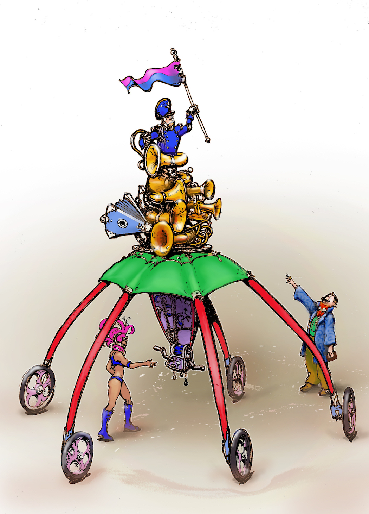

# R.O.B.O.T.


# TODOs
See [TODO](TODO.md).

# Setting up

## Install prerequisite packages
* `python2.7-dev`
* `virtualenv`
* `libasound2-dev`
* `libjack-dev`

## Create Virtualenv
```
virtualenv ~/venv
source ~/venv/bin/activate
```

## Clone this repo
```
git clone git://github.com/xunil/robot.git
```

## Check out the appropriate branch
```
cd robot
git checkout xunil/separate-midi-server
```

## Install Pip packages
```
cd robot
pip install -r requirements.txt
```

# Starting on the Sky Pi
Shouldn't be necessary to do this by hand on the "production" install.  The Sky Pi process should start on its own.
```
source ~/venv/bin/activate
cd robot
nohup python sky_pi.py >> sky_pi.out 2>&1 &
```

# Starting on the Mud Pi
As above, shouldn't be necessary to do this by hand on the "production" install.  The Mud Pi process should start on its own.
```
source ~/venv/bin/activate
cd robot
nohup python midiserver/midiserver.py >> midiserver.out 2>&1 &
nohup flask run --host=0.0.0.0 >> flask.out 2>&1 &
```

